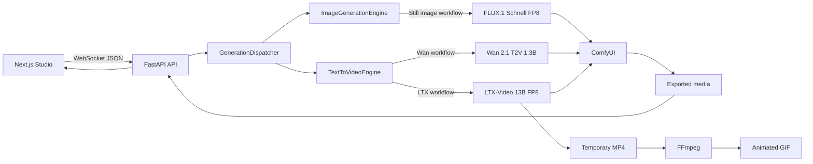

# Local Generative Video Studio

Local Generative Video Studio is an Apple Silicon application for prompt-driven
video, still-image, and animated-GIF generation. FastAPI submits workflows to a
local ComfyUI instance; the Next.js studio streams progress over WebSocket and
serves generated media from the local export directory.

## Features

- Wan 2.1 T2V 1.3B and LTX-Video 13B distilled FP8 video workflows
- FLUX.1 Schnell FP8 still-image generation
- Photo, 3D render, graphic, and art image styles
- Animated GIF generation through LTX-Video followed by FFmpeg palette encoding
- Live ComfyUI progress, cancellation, queue clearing, MP4/PNG/GIF downloads
- Apple MPS detection and local export/latent storage

## Requirements

- macOS on Apple Silicon; the documented target is an M4 Pro with 48 GB unified memory
- Python 3.12 or newer for this project
- Python 3.11 for the ComfyUI environment
- `uv`, `curl`, `git`, and `ffmpeg`
- Ollama if language-model requests are enabled
- A separate ComfyUI checkout with its own virtual environment

Model weights are intentionally not committed to this repository.

## Architecture

The platform has four runtime layers:

1. **Next.js Studio**. Provides the chat interface and Image/Video mode
  controls, sends generation requests through
  `ws://127.0.0.1:8000/ws/generation`, and displays progress events and
  completed media.

1. **FastAPI Backend**. Validates request payloads with Pydantic, creates
  generation jobs through `GenerationDispatcher`, broadcasts queued/progress/
  completion/error events, and serves generated media from `/exports`.

1. **Generation Pipelines**. `ImageGenerationEngine` builds FLUX still-image
  workflows, `TextToVideoEngine` builds Wan or LTX video workflows, and
  animated GIF requests use LTX video generation followed by FFmpeg conversion.

1. **ComfyUI Inference Runtime**. Receives API-format workflows through
  `POST /prompt`, executes the selected model and custom nodes, streams
  execution events through its WebSocket API, and returns generated image,
  video, and latent artifacts.

### Request Flow



### Model Routing

| Output | Pipeline | Model |
| --- | --- | --- |
| Photo, 3D, Graphic, or Art image | `ImageGenerationEngine` | `flux1-schnell-fp8.safetensors` |
| Wan video | `TextToVideoEngine` | `wan2.1_t2v_1.3B_fp16.safetensors` |
| LTX video | `TextToVideoEngine` | `ltxv-13b-0.9.8-distilled-fp8.safetensors` |
| Animated GIF | LTX pipeline followed by FFmpeg | LTX-Video 13B FP8 |

A still-image request runs this ComfyUI workflow:

`CheckpointLoaderSimple -> CLIPTextEncode -> ConditioningZeroOut -> EmptySD3LatentImage -> KSampler -> VAEDecode -> SaveImage`

A video request runs either the Wan or LTX workflow and ends with
`VHS_VideoCombine`. An animated GIF uses the LTX video workflow, saves an
intermediate MP4, and converts it to `image.gif` using FFmpeg.

### Storage Flow

Generated artifacts are copied from ComfyUI into:

```text
backend/storage/exports/<run-id>/
```

Video latents are additionally copied into:

```text
backend/storage/latents/<run-id>/
```

The backend returns `image_url` for still images and GIFs, and `video_url` for
generated videos.

## Project Setup

From the repository root:

```sh
./scripts/setup_env.sh
```

The script installs the project dependencies with `uv` and verifies that
`torch.backends.mps.is_available()` is true. It does not install ComfyUI or
download model weights.

The equivalent manual setup is:

```sh
uv sync
uv run python -c 'import torch; print(torch.backends.mps.is_available())'
```

## ComfyUI Setup

Set the ComfyUI location once per shell. The scripts default to this path:

```sh
export COMFYUI_DIR=/Users/kannan.s/projects/AIML/ComfyUI
```

Create the separate ComfyUI environment:

```sh
cd "$(dirname "$COMFYUI_DIR")"
git clone https://github.com/comfyanonymous/ComfyUI.git ComfyUI
cd "$COMFYUI_DIR"
uv venv --python 3.11
uv pip install --python .venv/bin/python -r requirements.txt
if [ -f manager_requirements.txt ]; then
  uv pip install --python .venv/bin/python -r manager_requirements.txt
fi
```

If the checkout already exists, skip `git clone`. Do not install ComfyUI
dependencies into the project environment.

### VideoHelperSuite

`VHS_VideoCombine` is required for MP4 output and GIF generation. Install the
custom node into ComfyUI:

```sh
mkdir -p "$COMFYUI_DIR/custom_nodes"
cd "$COMFYUI_DIR/custom_nodes"
if [ ! -d ComfyUI-VideoHelperSuite ]; then
  git clone https://github.com/Kosinkadink/ComfyUI-VideoHelperSuite.git
fi
if [ -f ComfyUI-VideoHelperSuite/requirements.txt ]; then
  uv pip install --python "$COMFYUI_DIR/.venv/bin/python" \
    -r ComfyUI-VideoHelperSuite/requirements.txt
fi
```

Install FFmpeg separately if it is not already available:

```sh
brew install ffmpeg
ffmpeg -version
```

## Model Installation

The application currently expects this model layout:

| Feature | Model file | Folder | Approximate size |
| --- | --- | --- | ---: |
| Wan video | `wan2.1_t2v_1.3B_fp16.safetensors` | `models/diffusion_models` | 2.6 GB |
| Wan text encoder | `umt5_xxl_fp8_e4m3fn_scaled.safetensors` | `models/text_encoders` | 6.3 GB |
| Wan VAE | `wan_2.1_vae.safetensors` | `models/vae` | 242 MB |
| LTX video | `ltxv-13b-0.9.8-distilled-fp8.safetensors` | `models/checkpoints` | 15.69 GB |
| LTX text encoder | `t5xxl_fp8_e4m3fn_scaled.safetensors` | `models/text_encoders` | 4.8 GB |
| FLUX still image | `flux1-schnell-fp8.safetensors` | `models/checkpoints` | 17.2 GB |

The local `du` output may show binary units, for example 15G or 16G. The LTX
file's exact size is `15,694,280,140` bytes, which is 15.69 GB decimal or
14.62 GiB.

Create the directories before downloading:

```sh
mkdir -p "$COMFYUI_DIR/models/diffusion_models" \
  "$COMFYUI_DIR/models/checkpoints" \
  "$COMFYUI_DIR/models/text_encoders" \
  "$COMFYUI_DIR/models/vae"
```

### Wan 2.1

```sh
curl -L --fail --retry 10 --retry-delay 5 --continue-at - \
  -o "$COMFYUI_DIR/models/diffusion_models/wan2.1_t2v_1.3B_fp16.safetensors" \
  "https://huggingface.co/Comfy-Org/Wan_2.1_ComfyUI_repackaged/resolve/main/split_files/diffusion_models/wan2.1_t2v_1.3B_fp16.safetensors"
curl -L --fail --retry 10 --retry-delay 5 --continue-at - \
  -o "$COMFYUI_DIR/models/text_encoders/umt5_xxl_fp8_e4m3fn_scaled.safetensors" \
  "https://huggingface.co/Comfy-Org/Wan_2.1_ComfyUI_repackaged/resolve/main/split_files/text_encoders/umt5_xxl_fp8_e4m3fn_scaled.safetensors"
curl -L --fail --retry 10 --retry-delay 5 --continue-at - \
  -o "$COMFYUI_DIR/models/vae/wan_2.1_vae.safetensors" \
  "https://huggingface.co/Comfy-Org/Wan_2.1_ComfyUI_repackaged/resolve/main/split_files/vae/wan_2.1_vae.safetensors"
```

### LTX-Video 13B

The distilled FP8 checkpoint replaces the older LTX 2B reference:

```sh
curl -L --fail --retry 10 --retry-delay 5 --continue-at - \
  -o "$COMFYUI_DIR/models/checkpoints/ltxv-13b-0.9.8-distilled-fp8.safetensors" \
  "https://huggingface.co/Lightricks/LTX-Video/resolve/main/ltxv-13b-0.9.8-distilled-fp8.safetensors"
curl -L --fail --retry 10 --retry-delay 5 --continue-at - \
  -o "$COMFYUI_DIR/models/text_encoders/t5xxl_fp8_e4m3fn_scaled.safetensors" \
  "https://huggingface.co/comfyanonymous/flux_text_encoders/resolve/main/t5xxl_fp8_e4m3fn_scaled.safetensors"
```

For an exact-size check after downloading:

```sh
test "$(wc -c < "$COMFYUI_DIR/models/checkpoints/ltxv-13b-0.9.8-distilled-fp8.safetensors" | tr -d ' ')" = "15694280140"
test "$(wc -c < "$COMFYUI_DIR/models/text_encoders/t5xxl_fp8_e4m3fn_scaled.safetensors" | tr -d ' ')" = "5157348688"
```

### FLUX.1 Schnell FP8

FLUX powers still images in Photo, 3D render, Graphic, and Art styles. The
combined checkpoint is loaded from `models/checkpoints` by the current workflow:

```sh
curl -L --fail --retry 10 --retry-delay 5 --continue-at - \
  -o "$COMFYUI_DIR/models/checkpoints/flux1-schnell-fp8.safetensors" \
  "https://huggingface.co/Comfy-Org/flux1-schnell/resolve/main/flux1-schnell-fp8.safetensors"
```

Use a `.part` suffix and atomically rename the file when downloading to a new
machine. This prevents ComfyUI from discovering a partially downloaded model:

```sh
curl -L --fail --retry 10 --retry-delay 5 --continue-at - \
  -o "$COMFYUI_DIR/models/checkpoints/flux1-schnell-fp8.safetensors.part" \
  "https://huggingface.co/Comfy-Org/flux1-schnell/resolve/main/flux1-schnell-fp8.safetensors"
mv "$COMFYUI_DIR/models/checkpoints/flux1-schnell-fp8.safetensors.part" \
  "$COMFYUI_DIR/models/checkpoints/flux1-schnell-fp8.safetensors"
```

### Remove the old LTX 2B checkpoint

Only remove the old file after the 13B file exists and passes its size check:

```sh
test -f "$COMFYUI_DIR/models/checkpoints/ltxv-13b-0.9.8-distilled-fp8.safetensors" \
  && rm -f "$COMFYUI_DIR/models/checkpoints/ltx-video-2b-v0.9.safetensors"
```

## Verify ComfyUI

Restart ComfyUI after adding models or custom nodes:

```sh
cd "$COMFYUI_DIR"
"$COMFYUI_DIR/.venv/bin/python" main.py --listen 127.0.0.1 --port 8188
```

In another terminal, verify that ComfyUI is reachable and has the required
node registry:

```sh
curl --fail --silent http://127.0.0.1:8188/object_info > /tmp/comfy-object-info.json
uv run python - <<'PY'
import json

with open('/tmp/comfy-object-info.json') as file:
    nodes = json.load(file)

for name in ('CheckpointLoaderSimple', 'CLIPLoader', 'EmptyLTXVLatentVideo',
             'VHS_VideoCombine', 'KSampler', 'ConditioningZeroOut'):
    print(f'{name}: {"OK" if name in nodes else "MISSING"}')
PY
```

Also inspect the actual files ComfyUI can see:

```sh
find "$COMFYUI_DIR/models" -maxdepth 2 -type f \
  \( -name '*.safetensors' -o -name '*.ckpt' \) -print | sort
```

## Run The Studio

The managed launcher starts ComfyUI, the Next.js frontend, and FastAPI:

```sh
./scripts/start_server.sh
```

It uses `COMFYUI_DIR`, `COMFYUI_PYTHON`, `COMFYUI_HOST`, and `COMFYUI_PORT` if
you need a non-default ComfyUI checkout. The studio is available at
`http://127.0.0.1:3000`, FastAPI at `http://127.0.0.1:8000`, and ComfyUI at
`http://127.0.0.1:8188`.

Alternatively, `run_local_studio.sh` reuses an already-running ComfyUI and
starts the project services while following `backend/storage/comfyui.log`:

```sh
./run_local_studio.sh
```

Use only one launcher for a given run. Neither launcher downloads model weights.
Stop managed services with:

```sh
./scripts/stop_server.sh
```

## Generation Modes

In the chat composer, select **Video** or **Image**.

### Video

Video supports the existing Wan 2.1 and LTX-Video 13B workflows. LTX requires
width and height divisible by 32 and a frame count of `8n + 1`. The tested
small profile is 512x288 with 49 frames. Portrait output swaps the dimensions.

### Still image

Select **Image**, choose `1:1`, `16:9`, or `9:16`, then choose Photo, 3D
render, Graphic, or Art. These styles use FLUX.1 Schnell FP8. Open Studio
settings to choose an image quality profile:

| Profile | 1:1 | 16:9 | 9:16 | Steps | Use |
| --- | ---: | ---: | ---: | ---: | --- |
| Draft | 512x512 | 768x432 | 432x768 | 4 | Faster previews and lower memory use |
| Standard | 768x768 | 1024x576 | 576x1024 | 4 | Default balanced profile |
| High | 1024x1024 | 1152x648 | 648x1152 | 8 | More detail at higher memory cost |

Width, height, steps, and seed can also be edited directly. Image dimensions
must be at least 64 pixels and divisible by 16. Increasing resolution is the
main quality control and increases MPS memory use; increasing steps increases
render time and is most useful with the High profile.

### Animated GIF

Select **Image -> Animated GIF**. The request is routed to LTX-Video 13B for a
49-frame, 12 fps clip, then FFmpeg converts the generated MP4 to
`image.gif`. GIF generation uses LTX, not FLUX, and uses its fixed 512x288,
49-frame profile so the LTX dimensions and frame constraints remain valid.

Direct GIF WebSocket smoke test:

```sh
cd /Users/kannan.s/projects/AIML/local-video-platform
uv run python - <<'PY'
import asyncio
import json
import websockets

async def main():
    payload = {
        'generation_type': 'image',
        'style': 'gif',
        'prompt': 'A colorful parrot eating watermelon, gently bobbing its head, seamless loop',
        'aspect_ratio': '16:9',
        'seed': 73,
    }
    async with websockets.connect('ws://127.0.0.1:8000/ws/generation') as socket:
        await socket.send(json.dumps(payload))
        while True:
            event = json.loads(await socket.recv())
            print(event)
            if event.get('type') in {'complete', 'error'}:
                break

asyncio.run(main())
PY
```

Completed media is stored in `backend/storage/exports/<run-id>/` and served at
`http://127.0.0.1:8000/exports/<run-id>/<filename>`.

## WebSocket Contract

Connect to `ws://127.0.0.1:8000/ws/generation`. Video requests use the existing
video payload. Image requests use this shape:

```json
{
  "generation_type": "image",
  "style": "3d",
  "prompt": "A glass greenhouse on a red desert planet",
  "aspect_ratio": "16:9",
  "seed": 73
}
```

The server emits `accepted`, `progress`, `complete`, `error`, and `cancelled`
events. Still-image and GIF completion events contain `image_url`; video
completion events contain `video_url`. Lifecycle events are logged even when
ComfyUI does not provide a numeric percentage.

## Validation

Run these checks from the repository root:

```sh
uv run python -m compileall -q backend
npm --prefix frontend run lint
npm --prefix frontend run build
```

Check service health and the ComfyUI queue:

```sh
curl --fail http://127.0.0.1:8000/health
curl --fail http://127.0.0.1:8188/queue
```

## Troubleshooting

### Model not found

Check the exact filename and folder in the model table, remove any `.part`
file, restart ComfyUI, and query `/object_info` again. ComfyUI's registry is
the authority for the names exposed to workflows.

### LTX or GIF errors

Confirm the LTX checkpoint, T5-XXL encoder, VideoHelperSuite, and `ffmpeg` are
installed. LTX dimensions must be divisible by 32 and frames must equal
`8n + 1`. Lower the GIF dimensions if MPS memory is tight.

### Progress appears in the UI but not the terminal

Inspect both `backend/storage/comfyui.log` and the FastAPI terminal. The backend
logs numeric progress and lifecycle events. A completion event must include an
export path; an FFmpeg failure during GIF conversion is reported as an error.

### MPS is unavailable

Use a native Apple Silicon Python and run:

```sh
uv run python -c 'import torch; print(torch.backends.mps.is_available())'
```

### Truncated safetensors file

An error such as `SafetensorError: incomplete metadata` means the download is
incomplete. Delete the affected file, repeat the resumable download, verify its
size, and restart ComfyUI.

## Project Layout

```text
backend/                 FastAPI routes, ComfyUI client, and pipelines
backend/storage/         exports, latents, logs, and runtime PID files
frontend/                Next.js studio and WebSocket client
scripts/setup_env.sh     project dependency and MPS setup
scripts/start_server.sh  managed ComfyUI, frontend, and FastAPI startup
scripts/stop_server.sh   managed process shutdown
run_local_studio.sh      reuse services and follow local ComfyUI logs
pyproject.toml           project dependencies and uv metadata
```
